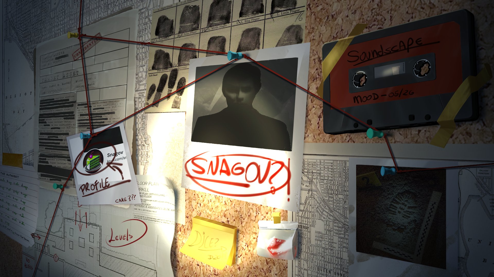

# Token Action HUD SWADE for FoundryVTT
[]() []() [](https://forge-vtt.com/bazaar#package=token-action-hud-swade)

<center>
<a href='https://ko-fi.com/snagov' target='_blank'></a>
</center>

## Overview

A plug-in module for [Token Action HUD Core](https://foundryvtt.com/packages/token-action-hud-core) which adds support for the [Savage Worlds Adventure Edition](https://foundryvtt.com/packages/swade) system. It puts a token's attributes, skills, powers, items and status effects one click away, directly on the canvas.

If you want to learn how to use Token Action HUD, please check the [Token Action HUD tutorials](https://github.com/Larkinabout/fvtt-token-action-hud-core/wiki/How-to-Use-Token-Action-HUD) wiki.

## Features

- **Traits at a glance**: Attributes, skills and the running die, each showing its current die and modifier.
- **Items**: Weapons, powers, gear, consumables, armor, shields and actions, with damage or charges displayed inline. Favorites are split into their own quick-access groups.
- **Power Points**: Per-arcane pools with inline spend and restore buttons.
- **Bennies, Wounds and Fatigue**: Spend or award bennies and adjust wound and fatigue levels without opening the sheet.
- **Status Effects**: Toggle any system status, plus the active effects granted by edges, hindrances, abilities, weapons and armor.
- **Vehicles**: Maneuver checks for the crew's operator, vehicle weapons fired by the assigned crew member, cargo and wounds.
- **"Help me" reference**: The core SWADE main and free actions, one click away, for players still learning the system.

## Supported Modules

Token Action HUD SWADE rolls through the core SWADE system by default, and integrates with:

- [Better Rolls 2 for Savage Worlds](https://foundryvtt.com/packages/betterrolls-swade2) — four click behaviours (default, Ctrl, Shift, Alt) selectable in the settings.
- [Swade Tools](https://foundryvtt.com/packages/swade-tools)

### Core SWADE


### Better Rolls 2


## Behaviour reminders from HUD Core

- The image of the items can be displayed by selecting 'Display Icons' in the HUD Core settings.
- Right clicking will open the item's window by selecting 'Open Item Sheet on Right-Click' in the HUD Core settings (right-clicking on a pool name will do nothing).
- Some users might prefer to enable 'Click to Open Categories' in the HUD Core settings, so that hovering over HUD category names doesn't automatically open the sub-menu.

## Installation

It can be installed by searching in Foundry's module installer, or by directly entering the following URL:

```
https://github.com/mrcomac/token-action-hud-swade/releases/latest/download/module.json
```

Token Action HUD Core and the SWADE system must be installed and active as well.

## What are we doing?

[Sprint board of v0.X.X](https://github.com/users/mrcomac/projects/2)

## License

This software is released under the MIT license.
